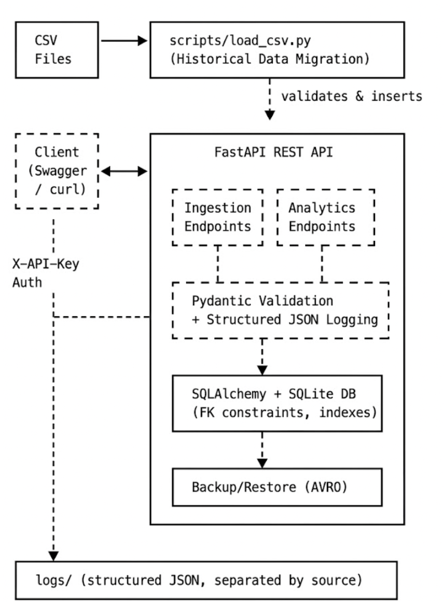

# Data Engineering Challenge

REST API for data ingestion, analytics, and AVRO backup/restore — built with FastAPI, SQLAlchemy, and SQLite.

## Quick Start (Docker)

```bash
docker compose up -d --build
docker compose exec api python -m scripts.load_csv
open http://localhost:8000/docs
```

That's it. Swagger UI is live at [http://localhost:8000/docs](http://localhost:8000/docs).

## Architecture



## Project Structure

```
data-challenge/
├── app/
│   ├── main.py          # FastAPI entry point
│   ├── config.py        # Environment variables
│   ├── database.py      # SQLAlchemy engine & session
│   ├── models.py        # ORM models (departments, jobs, hired_employees)
│   ├── schemas.py       # Pydantic validation schemas
│   ├── auth.py          # API key middleware
│   ├── logger.py        # Structured JSON logging
│   └── routes/
│       ├── ingestion.py # POST endpoints for batch data insert
│       ├── analytics.py # GET endpoints for Challenge #2
│       └── backup.py    # AVRO backup & restore
├── scripts/
│   └── load_csv.py      # Historical CSV migration
├── data/                # Source CSV files (no headers)
├── backups/             # AVRO backup files (timestamped)
├── logs/                # Structured validation logs
│   ├── api/             # Logs from API ingestion
│   └── migration/       # Logs from CSV migration (per run)
├── tests/
├── Dockerfile
├── docker-compose.yml
├── requirements.txt
└── .env
```

## API Endpoints

All endpoints require `X-API-Key: globant-challenge-XXX` header.

### Ingestion (Challenge #1)

| Method | Path | Description |
|--------|------|-------------|
| POST | `/api/v1/departments` | Batch insert departments (1-1000 rows) |
| POST | `/api/v1/jobs` | Batch insert jobs (1-1000 rows) |
| POST | `/api/v1/hired-employees` | Batch insert employees (with FK validation) |

### Analytics (Challenge #2)

| Method | Path | Description |
|--------|------|-------------|
| GET | `/api/v1/analytics/employees-by-quarter` | Hires by department+job per quarter (2021) |
| GET | `/api/v1/analytics/departments-above-average` | Departments that hired above 2021 average |

### Backup & Restore

| Method | Path | Description |
|--------|------|-------------|
| POST | `/api/v1/backup/{table_name}` | Export table to AVRO |
| POST | `/api/v1/restore/{table_name}` | Restore from latest AVRO backup |

## Usage Examples

### Load historical data
```bash
docker compose exec api python -m scripts.load_csv
# Loads: 12 departments, 183 jobs, 1929 employees (70 invalid rows logged)
```

### Batch insert employees
```bash
curl -X POST http://localhost:8000/api/v1/hired-employees \
  -H "X-API-Key: globant-challenge-XXX" \
  -H "Content-Type: application/json" \
  -d '[
    {"id": 2000, "name": "Ana Garcia", "datetime": "2021-06-15T10:00:00Z", "department_id": 1, "job_id": 1},
    {"id": 2001, "name": "", "datetime": "bad-date", "department_id": 999, "job_id": 1}
  ]'
# Response:
# {"inserted": 1, "errors": [{"row": 2, "reasons": ["name is required", "datetime must be in ISO 8601 format", "department_id 999 not found"]}]}
```

### Query analytics
```bash
# Employees hired per quarter (2021)
curl http://localhost:8000/api/v1/analytics/employees-by-quarter \
  -H "X-API-Key: globant-challenge-XXX"
# [{"department": "Accounting", "job": "Account Representative IV", "Q1": 1, "Q2": 0, "Q3": 0, "Q4": 0}, ...]

# Departments above average hiring (2021)
curl http://localhost:8000/api/v1/analytics/departments-above-average \
  -H "X-API-Key: globant-challenge-XXX"
# [{"id": 8, "department": "Support", "hired": 216}, ...]
```

### Backup and restore
```bash
# Backup
curl -X POST http://localhost:8000/api/v1/backup/departments \
  -H "X-API-Key: globant-challenge-XXX"
# {"message": "Backup saved", "table": "departments", "records": 12, "path": "backups/departments_2026-08-24_001813.avro"}

# Restore
curl -X POST http://localhost:8000/api/v1/restore/departments \
  -H "X-API-Key: globant-challenge-XXX"
# {"message": "Restored 12 records to departments", "table": "departments", "records": 12, "source": "departments_2026-08-24_001813.avro"}
```

## Design Decisions

### Why SQLite?
- Zero-config, portable, reviewer-friendly — clone and run with no external DB
- Sufficient for the data volume (~2000 rows)
- FK constraints enabled; indexes on datetime and FK columns

### Why separate endpoints per table?
- Each table has different validation rules (FK checks only on hired_employees)
- Cleaner Swagger docs and targeted error messages
- Follows REST convention of one resource per route

### Batch response pattern
Partial success is allowed. The response reports both inserted count and per-row errors with reasons, so callers know exactly what failed without re-submitting the entire batch.

### SQL optimizations
- **Sargable date filters**: range-based (`>=` / `<`) instead of `strftime()` on every row — allows index seeks
- **CTEs**: `departments-above-average` uses `WITH` clauses for readability and avoiding repeated subqueries
- **Indexes**: on `datetime`, `department_id`, `job_id` — critical at production scale

### Logging
- Structured JSON (one entry per line)
- Separated by source: `logs/api/` for API requests, `logs/migration/<run_id>/` for CSV loads
- One file per table within each source

### Production considerations (not implemented — out of scope)
- **Materialized views** for pre-computed analytics
- **Table partitioning** by year for large datasets
- **Stored procedures** (not supported by SQLite; would use in PostgreSQL)
- **Rate limiting** (e.g., slowapi)
- **CORS configuration** for production domains

## Security

- API key authentication via `X-API-Key` header
- Batch size capped at 1000 rows per request
- Pydantic validates all input types and formats
- SQLAlchemy parameterized queries prevent SQL injection
- FK constraints enforced at both application and database level

## Tech Stack

| Component | Version |
|-----------|---------|
| Python | 3.11 (Docker) |
| FastAPI | 0.115.0 |
| SQLAlchemy | 2.0.35 |
| Pydantic | 2.9.2 |
| fastavro | 1.9.7 |
| uvicorn | 0.30.6 |

## Local Development (without Docker)

```bash
python3 -m venv .venv
source .venv/bin/activate
pip install -r requirements.txt  # fastavro may fail on Python 3.13+
python -m scripts.load_csv
uvicorn app.main:app --port 8000 --reload
```

> **Note**: `fastavro` requires Python ≤3.12 for local wheel builds. Use Docker for full functionality including backup/restore.
